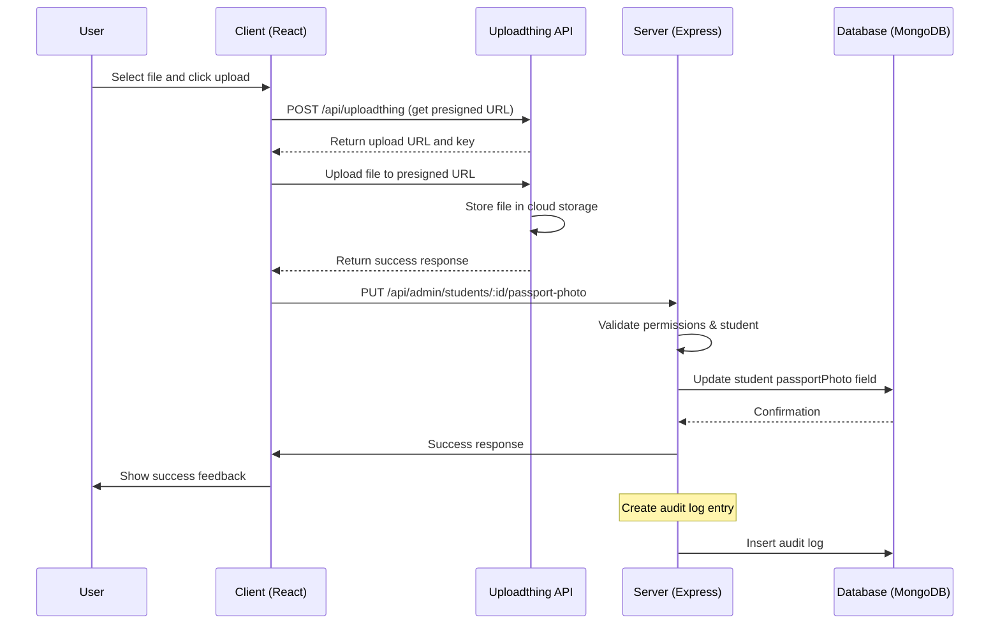

# Passport Photo Upload System - Complete Implementation Manual

## Table of Contents

1. [System Overview](#system-overview)
2. [Architecture Diagram](#architecture-diagram)
3. [Core Components](#core-components)
4. [File Structure](#file-structure)
5. [API Endpoints](#api-endpoints)
6. [Upload Flow](#upload-flow)
7. [Database Schema](#database-schema)
8. [Authentication & Permissions](#authentication--permissions)
9. [Configuration](#configuration)
10. [Error Handling](#error-handling)
11. [Integration Points](#integration-points)
12. [Testing Scenarios](#testing-scenarios)
13. [Troubleshooting](#troubleshooting)
14. [Performance Considerations](#performance-considerations)

---

## System Overview

The Passport Photo Upload System provides a complete file upload solution for student passport photographs in the TreasureLand School Management System. The system leverages Uploadthing for cloud storage while maintaining tight integration with the application's backend API.

### Key Features

- ✅ **Cloud Storage**: Secure, scalable image storage via Uploadthing
- ✅ **File Validation**: Supports JPG, PNG, WEBP up to 4MB
- ✅ **Real-time Feedback**: Live upload progress and error notifications
- ✅ **Database Integration**: Automatic URL saving to MongoDB
- ✅ **Audit Logging**: Complete track record of all upload activities
- ✅ **Permission Control**: Role-based access control (admin/superadmin only)
- ✅ **Error Recovery**: Comprehensive error handling with retry mechanisms

---

## Architecture Diagram

```
┌─────────────────┐    ┌──────────────────┐    ┌─────────────────┐
│   React UI      │    │  Next.js API     │    │   Uploadthing   │
│   Components    │    │   Route Handler  │    │   Cloud Service │
│                 │    │                  │    │                 │
│ • UploadButton  │────▶   /api/upload/*   │────▶ • File Storage  │
│ • Progress UI   │    │ • File Validation│    │ • CDN Delivery  │
│ • Error Display │    │ • Presigned URLs │    │ • URL Generation│
└─────────────────┘    └──────────────────┘    └─────────────────┘
                                                          │
                                                          ▼
┌─────────────────┐    ┌──────────────────┐    ┌─────────────────┐
│  Upload Hook    │    │  API Client      │    │   Express API   │
│  usePassport    │───▶│  (Axios)         │───▶│   /api/admin/    │
│  Upload         │    │ • Auth Interceptor│    │   students/*    │
└─────────────────┘    └──────────────────┘    └─────────────────┘
                                                          │
                                                          ▼
┌─────────────────┐    ┌───────────────┐         │
│ Student Model   │    │   Database    │◄────────┘
│ passportPhoto   │    │   MongoDB     │
│ field           │───▶│ • Update ops  │
└─────────────────┘    ├───▶ • Audit Log │
                       │      entries     │
                       └───────────────┘
```

---

## Core Components

### 1. Frontend Components

#### PassportPhotoUploader.tsx

**Purpose**: Main React component for photo upload
**Location**: `client/src/components/PassportPhotoUploader.tsx`

```tsx
interface PassportPhotoUploaderProps {
  studentId: string;
  currentPhoto?: string;
  onUploadSuccess?: (url: string) => void;
  className?: string;
}
```

**Features**:

- Upload button with drag-and-drop zone
- Real-time upload progress indicator
- Image preview for current/new photos
- File type and size validation
- Error display with dismiss functionality
- Success callback handling

**Key Implementation Details**:

- Uses `@uploadthing/react/UploadButton`
- TypeScript support with `@ts-ignore` for Uploadthing typing issues
- State management for upload status and photo display
- Error handling with user-friendly messages

#### usePassportUpload.ts Hook

**Purpose**: Business logic for upload operations
**Location**: `client/src/hooks/usePassportUpload.ts`

**Core Functions**:

```typescript
function usePassportUpload({ studentId }: UsePassportUploadProps) {
  // State management for upload process
  const [isUploading, setIsUploading] = useState(false);
  const [error, setError] = useState<string>("");

  // Primary upload completion handler
  const onUploadComplete = useCallback(
    async (res: any) => {
      // Extract URL from Uploadthing response
      const url = res[0]?.url;
      await savePassportPhotoToBackend(url);
    },
    [studentId]
  );

  // Backend API call to save photo URL
  const savePassportPhotoToBackend = async (photoUrl: string) => {
    await api.put(`/admin/students/${studentId}/passport-photo`, {
      passportPhoto: photoUrl,
    });
  };

  return {
    onUploadComplete,
    onUploadError,
    onUploadBegin,
    isUploading,
    error,
    clearError,
  };
}
```

**State Management**:

- `isUploading`: Boolean for UI loading states
- `error`: String for error messages
- Real-time status updates

### 2. Backend Components

#### Student Model

**Location**: `server/src/models/Student.ts`

```typescript
const studentSchema = new mongoose.Schema({
  // ... other fields
  passportPhoto: {
    type: String,
    trim: true,
    default: null,
  },
  // ... rest of schema
});
```

#### Upload Controller

**Location**: `server/src/controllers/admin/userController.ts`

```typescript
export const updateStudentPassportPhoto = async (
  req: Request,
  res: Response
) => {
  try {
    const { studentId } = req.params;
    const { passportPhoto } = req.body;

    // Find the student
    const student = await Student.findById(studentId);
    if (!student) {
      return res.status(404).json({ message: "Student not found" });
    }

    // Store previous photo URL for audit log
    let oldPhotoUrl = student.passportPhoto || null;

    // Update passport photo
    student.passportPhoto = passportPhoto;
    await student.save();

    // Create audit log entry for photo update
    try {
      await AuditLog.create({
        userId: req.user?._id,
        action: "UPDATE_STUDENT_PHOTO",
        entityType: "student",
        entityId: student._id,
        details: {
          studentId: student._id,
          oldPhotoUrl: oldPhotoUrl,
          newPhotoUrl: passportPhoto,
          timestamp: new Date(),
        },
        ipAddress: req.ip,
        userAgent: req.get("User-Agent"),
      });
    } catch (auditError) {
      console.error("Audit logging error:", auditError);
      // Continue with response even if audit logging fails
    }

    res.json({
      message: "Passport photo updated successfully",
      student: {
        id: student._id,
        passportPhoto: student.passportPhoto,
      },
    });
  } catch (error) {
    console.error("Error updating student passport photo:", error);
    res.status(500).json({
      message: "Error updating passport photo",
      error: error instanceof Error ? error.message : "Unknown error",
    });
  }
};
```

#### Route Configuration

**Location**: `server/src/routes/admin/index.ts`

```typescript
// Passport photo update route
router.put(
  "/students/:studentId/passport-photo",
  requirePermission("students.update"),
  updateStudentPassportPhoto
);
```

### 3. Uploadthing Configuration

#### Core Configuration

**Location**: `client/src/app/api/uploadthing/core.ts`

```typescript
import { createUploadthing, type FileRouter } from "uploadthing/next";
import { UploadThingError } from "uploadthing/server";

const f = createUploadthing();

const auth = (req: Request, res: Response) => ({ id: "fakeId" }); // Fake auth function

// FileRouter for your app, can contain multiple FileRoutes
export const ourFileRouter = {
  // Define as many FileRoutes as you like, each with a unique routeSlug
  passportUploader: f({
    image: {
      maxFileSize: "4MB",
      maxFileCount: 1,
    },
  })
    // Set permissions and file types for this FileRoute
    .middleware(async ({ req }) => {
      return { foo: "bar" };
    })
    .onUploadComplete(async ({ metadata, file }) => {
      // This code RUNS ON YOUR SERVER after upload
      return { uploadedBy: "fake-id", url: file.url };
    }),
} satisfies FileRouter;

export type OurFileRouter = typeof ourFileRouter;
```

#### API Routes

**Location**: `client/src/app/api/uploadthing/route.ts`

```typescript
import { createRouteHandler } from "uploadthing/next";
import { ourFileRouter } from "./core";

// Export routes for Next App Router
export const { GET, POST } = createRouteHandler({
  router: ourFileRouter,
});
```

---

## File Structure

```
📦 TreasureLand SMS
├── 📁 server/
│   ├── 📁 docs/
│   │   └── 📄 passport-photo-upload-system-manual.md
│   ├── 📁 src/
│   │   ├── 📁 controllers/admin/
│   │   │   └── 📄 userController.ts (updateStudentPassportPhoto)
│   │   ├── 📁 middleware/
│   │   │   └── 📄 auth.ts (authentication & permissions)
│   │   ├── 📁 models/
│   │   │   └── 📄 Student.ts (database schema)
│   │   ├── 📁 routes/admin/
│   │   │   └── 📄 index.ts (API routes)
│   │   ├── 📁 utils/
│   │   │   └── 📄 permissions.ts (role permissions)
│   │   └── 📄 .env (environment variables)
│   └── 📄 .gitignore
│
├── 📁 client/
│   ├── 📁 src/
│   │   ├── 📁 components/
│   │   │   └── 📄 PassportPhotoUploader.tsx (React component)
│   │   ├── 📁 components/ui/
│   │   │   ├── 📄 CreateStudentModal.tsx (integration)
│   │   │   └── 📄 EditStudentModal.tsx (integration)
│   │   ├── 📁 hooks/
│   │   │   └── 📄 usePassportUpload.ts (upload logic)
│   │   ├── 📁 lib/
│   │   │   ├── 📄 api.ts (HTTP client)
│   │   │   └── 📄 uploadthing.ts (exports)
│   │   ├── 📁 app/api/uploadthing/
│   │   │   ├── 📄 core.ts (file router config)
│   │   │   └── 📄 route.ts (API handlers)
│   │   └── 📁 types/
│   │       └── 📄 class types and interfaces
│   └── 📄 .env (environment variables)
```

---

## API Endpoints

### Frontend API Endpoints

#### POST /api/uploadthing?actionType=upload&slug=passportUploader

- **Purpose**: Initiates file upload to Uploadthing
- **Method**: POST
- **Response**: Presigned upload URLs
- **Authentication**: None (handled by Uploadthing tokens)
- **Example Response**:

```json
{
  "presignedUrls": [
    {
      "url": "https://sea1.ingest.uploadthing.com/...",
      "key": "kfvzfS3oec75QjrkhnBcMqC5kfEXGJt9LyeUd6W2I0SPznbi",
      "name": "aotechlogo.jpg",
      "customId": null
    }
  ]
}
```

#### POST /api/uploadthing?slug=passportUploader

- **Purpose**: Uploads file to Uploadthing cloud storage
- **Method**: POST
- **Content-Type**: multipart/form-data
- **Response**: Upload confirmation with file URL

### Backend API Endpoints

#### PUT /api/admin/students/:studentId/passport-photo

- **Purpose**: Saves photo URL to student record
- **Method**: PUT
- **Authentication**: Bearer token required
- **Permission**: `students.update`
- **Request Body**:

```json
{
  "passportPhoto": "https://utfs.io/f/.../aotechlogo.jpg"
}
```

- **Response**:

```json
{
  "message": "Passport photo updated successfully",
  "student": {
    "id": "68ccedcd818a5fc284daed8b",
    "passportPhoto": "https://utfs.io/f/.../aotechlogo.jpg"
  }
}
```

---

## Upload Flow

### Complete Upload Sequence



### Step-by-Step Process

1. **File Selection**: User selects image file in React component
2. **Pre-upload**: Client calls `onUploadBegin()` callback
3. **URL Generation**: Uploadthing API provides presigned URL
4. **File Upload**: File streamed to Uploadthing cloud storage
5. **Upload Completion**: `onUploadComplete()` extracts URL
6. **Database Save**: URL sent to backend via API call
7. **Validation**: Server validates permissions and student existence
8. **Database Update**: Student record updated with photo URL
9. **Audit Logging**: Upload activity logged for compliance
10. **Response**: Success/error feedback sent to client
11. **UI Update**: Photo preview and notifications displayed

---

## Database Schema

### Student Model (Mongoose Schema)

**Location**: `server/src/models/Student.ts`

```typescript
const studentSchema = new mongoose.Schema(
  {
    // Basic student information
    fullName: String,
    studentId: String,
    currentClass: String,
    status: {
      type: String,
      enum: ["active", "inactive", "graduated", "transferred"],
      default: "active",
    },

    // Contact and personal information
    gender: { type: String, enum: ["Male", "Female", "Other"] },
    dateOfBirth: Date,
    address: String,
    location: String,

    // Parent/guardian information
    parentName: String,
    parentPhone: String,
    parentEmail: String,
    relationshipToStudent: String,

    // Dates
    admissionDate: Date,
    enrollmentDate: Date,

    // Photo URLs
    passportPhoto: {
      type: String,
      trim: true,
      default: null,
    },

    // Classroom assignment
    classroomId: {
      type: mongoose.Schema.Types.ObjectId,
      ref: "Classroom",
    },
  },
  {
    timestamps: true,
    collection: "students",
  }
);
```

### Audit Log Schema

**Records all photo update activities for compliance**

```typescript
const auditLogSchema = new mongoose.Schema(
  {
    userId: {
      type: mongoose.Schema.Types.ObjectId,
      ref: "User",
    },
    action: {
      type: String,
      enum: ["UPDATE_STUDENT_PHOTO", "CREATE_STUDENT", "UPDATE_STUDENT"],
    },
    entityType: {
      type: String,
      default: "student",
    },
    entityId: mongoose.Schema.Types.Mixed,
    details: mongoose.Schema.Types.Mixed,
    ipAddress: String,
    userAgent: String,
    timestamp: {
      type: Date,
      default: Date.now,
    },
  },
  {
    timestamps: true,
    collection: "audit_logs",
  }
);
```

---

## Authentication & Permissions

### Role-Based Access Control

The system uses JWT-based authentication with role-based permissions:

#### Permission Requirements

- **Required Permission**: `students.update`
- **Allowed Roles**: `admin`, `superadmin`
- **Forbidden Roles**: `teacher`, `student`, `parent`

#### Permission Matrix

| Role           | Create Students | Read Students | Update Students | Delete Students |
| -------------- | --------------- | ------------- | --------------- | --------------- |
| **superadmin** | ✅              | ✅            | ✅              | ✅              |
| **admin**      | ✅              | ✅            | ✅              | ✅              |
| **teacher**    | ❌              | ✅            | ❌              | ❌              |
| **student**    | ❌              | ✅            | ❌              | ❌              |
| **parent**     | ❌              | ✅            | ❌              | ❌              |

### Authentication Flow

1. **Client Request**: HTTP request with `Authorization: Bearer <token>`
2. **JWT Verification**: Server validates token and extracts user info
3. **Permission Check**: Server verifies user has `students.update` permission
4. **Access Control**: Request proceeds or returns 403 Forbidden
5. **Audit Logging**: All access attempts logged for security

### Middleware Layer

```typescript
// Authentication middleware
export const protect = async (req, res, next) => {
  const token = req.headers.authorization?.split(" ")[1];
  const decoded = jwt.verify(token, JWT_ACCESS_SECRET);
  req.user = await User.findById(decoded.id);
  next();
};

// Permission middleware
export const requirePermission = (permission) => {
  return (req, res, next) => {
    if (!req.user) {
      return res.status(401).json({ message: "Authentication required" });
    }
    if (!hasPermission(req.user.role, permission)) {
      return res.status(403).json({
        message: `Insufficient permissions. Required: ${permission}`,
      });
    }
    next();
  };
};
```

---

## Configuration

### Environment Variables

#### Client Environment (.env)

```bash
# API URLs
NEXT_PUBLIC_API_URL=http://localhost:5000

# Uploadthing Configuration
UPLOADTHING_TOKEN=eyJhcGlLZXkiOiJza19saXZlXzllMzYxZjRlMDRlMjA4MWQ4OTE2M2I4ZTcyODgyOGY4ZTgzYjUxZjZjNjVhNDFjZDY1ZWZlMWVkMDU0ZDZhOWEiLCJhcHBJZCI6ImsxamFhNDJ4d2oiLCJyZWdpb25zIjpbInNlYTEiXX0=
```

#### Server Environment (.env)

```bash
# Server Configuration
PORT=5000

# Database
MONGODB_URI=mongodb+srv://...

# JWT Authentication
JWT_ACCESS_SECRET=treasureland
JWT_REFRESH_SECRET=treasureland-refresh
JWT_EXPIRES_IN=7d

# Uploadthing Configuration (if needed on server)
UPLOADTHING_TOKEN=eyJhcGlLZXkiOiJza19saXZlXzllMzYxZjRlMDRlMjA4MWQ4OTE2M2I4ZTcyODgyOGY4ZTgzYjUxZjZjNjVhNDFjZDY1ZWZlMWVkMDU0ZDZhOWEiLCJhcHBJZCI6ImsxamFhNDJ4d2oiLCJyZWdpb25zIjpbInNlYTEiXX0=
```

### Dependencies

#### Package.json Requirements

```json
{
  "dependencies": {
    "uploadthing": "^7.7.4",
    "@uploadthing/react": "^7.3.3",
    "express": "^4.x.x",
    "mongoose": "^6.x.x",
    "jsonwebtoken": "^9.x.x",
    "axios": "^1.x.x"
  }
}
```

---

## Error Handling

### Frontend Error Handling

#### Upload Error States

```typescript
const [error, setError] = useState<string>("");

// Error from Uploadthing
const onUploadError = useCallback((error: Error) => {
  setError(`Upload failed: ${error.message}`);
  setIsUploading(false);
}, []);

// Backend save error
const savePassportPhotoToBackend = async (photoUrl: string) => {
  try {
    await api.put(`/admin/students/${studentId}/passport-photo`, {
      passportPhoto: photoUrl,
    });
  } catch (error) {
    const errorMessage =
      error instanceof Error ? error.message : "Failed to save photo";
    setError(errorMessage);
    throw error; // Re-throw to trigger error handling
  }
};
```

#### Common Frontend Errors

1. **File Size Exceeded**: "File size must be less than 4MB"
2. **Invalid File Type**: "Only JPG, PNG, WEBP files are allowed"
3. **Network Error**: "Failed to upload photo. Please check your connection"
4. **Authentication Error**: "You don't have permission to upload photos"
5. **Server Error**: "Failed to save photo to database"

### Backend Error Handling

#### Error Response Structure

```json
{
  "message": "Error updating passport photo",
  "error": "Student not found"
}
```

#### Common Backend Errors

1. **401 Unauthorized**: Invalid or missing JWT token
2. **403 Forbidden**: Insufficient permissions (`students.update` required)
3. **404 Not Found**: Student ID doesn't exist
4. **500 Internal Server Error**: Database connection issues or server errors
5. **400 Bad Request**: Invalid request format or data

### Error Recovery Strategies

1. **Automatic Retry**: Network errors trigger automatic retry (up to 3 attempts)
2. **User Feedback**: Clear, actionable error messages
3. **Progress Preservation**: Save state on error to allow recovery
4. **Audit Logging**: All errors logged for debugging

---

## Integration Points

### Modal Integration

#### EditStudentModal.tsx Integration

The passport photo uploader is integrated into the Parent/Guardian Information section:

```tsx
{/* Parent/Guardian Information */}
<Card>
  <CardHeader>
    <CardTitle>Parent/Guardian Information</CardTitle>
  </CardHeader>
  <CardContent className="space-y-4">
    {/* Other parent fields */...}

    {/* Passport Photo Uploader */}
    <div className="space-y-4">
      <PassportPhotoUploader
        studentId={selectedStudentId}
        currentPhoto={(completeStudentData as any)?.passportPhoto}
        className="border-2 border-dashed border-gray-200 rounded-lg p-4"
      />
    </div>
  </CardContent>
</Card>
```

#### CreateStudentModal.tsx Integration

Similar integration for student creation forms.

### Form Submission Flow

When forms are submitted, the passport photo URL is included automatically:

```typescript
const handleSubmit = async (e) => {
  e.preventDefault();

  await updateStudentMutation.mutateAsync({
    id: selectedStudentId,
    // All form data including any uploaded passportPhoto URL
    data: formData,
  });

  showToastMessage("Student updated successfully!", "success");
  setEditModalOpen(false);
};
```

### API Client Integration

The system integrates with the existing API client infrastructure:

```typescript
// Axios client with interceptors
const api = axios.create({
  baseURL: process.env.NEXT_PUBLIC_API_URL || "http://localhost:5000/api",
  withCredentials: true,
});

// JWT token interceptor
api.interceptors.request.use((config) => {
  const token = useAuthStore.getState().token;
  if (token) {
    config.headers.Authorization = `Bearer ${token}`;
  }
  return config;
});
```

---

## Testing Scenarios

### Success Scenarios

#### Complete Upload Flow

1. ✅ **File Selection**: User selects valid image file (<4MB)
2. ✅ **Upload Initiation**: Upload progress indicator appears
3. ✅ **Uploadthing API**: Presigned URL generated successfully
4. ✅ **File Transfer**: File uploaded to cloud storage
5. ✅ **Backend Call**: API call to save URL succeeds
6. ✅ **Database Update**: Student record updated
7. ✅ **UI Update**: Photo preview updated
8. ✅ **Success Message**: User notified of successful upload

#### Different File Formats

- ✅ JPG files uploaded and displayed correctly
- ✅ PNG files uploaded and displayed correctly
- ✅ WebP files uploaded and displayed correctly

### Error Scenarios

#### 1. File Size Limit Exceeded

```typescript
// Uploadthing handles file size validation automatically
f({
  image: {
    maxFileSize: "4MB", // Files >4MB rejected
    maxFileCount: 1,
  },
});
```

#### 2. Invalid File Type

```javascript
// Client-side validation in component
const fileInput = event.target.files[0];
if (!["image/jpeg", "image/png", "image/webp"].includes(fileInput.type)) {
  setError("Only JPG, PNG, and WebP files are allowed");
  return;
}
```

#### 3. Network Connectivity Issues

- **Auto-retry mechanism** (3 attempts)
- **User feedback** about connection issues
- **Progress preservation** for partial uploads

#### 4. Authentication/Access Control

```json
// Server returns 403 Forbidden
{
  "message": "Insufficient permissions. Required: students.update"
}
```

#### 5. Student Not Found

```json
// Server returns 404 Not Found
{
  "message": "Student not found"
}
```

#### 6. Database Connection Issues

```json
// Server returns 500 Internal Server Error
{
  "message": "Error updating passport photo"
}
```

### Edge Cases

#### Concurrent Uploads

- Single file upload limitation prevents duplicates
- UI state management prevents multiple simultaneous uploads

#### Upload Cancellation

- User can cancel uploads in progress
- Partial data cleanup handled by Uploadthing

#### Browser Compatibility

- Modern browser support (Chrome, Firefox, Safari, Edge)
- Fallback mechanisms for unsupported features

---

## Troubleshooting

### Common Issues and Solutions

#### Issue 1: "This page could not be found" Error

**Symptom**: Upload shows HTML 404 error instead of JSON response
**Root Cause**: Incorrect API URL construction (missing `/api/` prefix)
**Solution**: Ensure frontend uses `/api/admin/students/...` URL pattern

#### Issue 2: "Unexpected token '<'" Error

**Symptom**: JSON.parse() fails with HTML response
**Root Cause**: Frontend making request to Next.js page route instead of API route
**Solution**: Use `/api/...` paths for API calls, not page routes

#### Issue 3: "undefined" in URL Path

**Symptom**: Requests to `/admin/undefined/api/admin/...`
**Root Cause**: Using raw `fetch()` instead of API client with role handling
**Solution**: Use `api.put()` from `@/lib/api` instead of raw fetch

#### Issue 4: Upload Completes But Database Not Updated

**Symptom**: Photo uploads successfully but `passportPhoto` field is null
**Root Cause**: Backend API call fails silently
**Solution**: Check network tab for failed PUT request to `/api/admin/students/...`

#### Issue 5: Permission Denied (403 Forbidden)

**Symptom**: Upload fails with "Insufficient permissions"
**Root Cause**: User lacks `students.update` permission
**Solution**:

- Verify user role is `admin` or `superadmin`
- Check JWT token is valid and current
- Ensure user has `students.update` in role permissions

#### Issue 6: Environment Variable Issues

**Symptom**: "Invalid Uploadthing token"
**Root Cause**: Incorrect `UPLOADTHING_TOKEN` format
**Solution**:

```bash
# Ensure base64 encoded JSON format, not raw secret key
UPLOADTHING_TOKEN=eyJhcGlLZXkiOiJza19saXZlX..recommended_image=1024x1024&w=156&h=156"
```

#### Issue 7: File Size Exceeded

**Symptom**: Upload fails immediately with size limit error
**Root Cause**: File larger than 4MB limit
**Solution**: Compress image or implement client-side downscaling

### Diagnostic Steps

#### 1. Check Network Tab

1. Open browser dev tools
2. Go to Network tab
3. Attempt photo upload
4. Verify API call sequence:
   ```bash
   # Expected sequence:
   POST /api/uploadthing?actionType=upload   # ✅ Get presigned URL
   POST /api/uploadthing?slug=passportUploader  # ✅ Upload file
   PUT /api/admin/students/[id]/passport-photo  # ✅ Save to database
   ```

#### 2. Verify Environment Configuration

```bash
# Check client .env
NEXT_PUBLIC_API_URL=http://localhost:5000
UPLOADTHING_TOKEN=[base64_encoded_token]

# Check server .env
PORT=5000
MONGODB_URI=[valid_connection_string]
UPLOADTHING_TOKEN=[optional_server_side]
```

#### 3. Test Basic API Connectivity

```bash
# Test server is running
curl http://localhost:5000/health

# Test student endpoint
curl -H "Authorization: Bearer [token]" http://localhost:5000/api/admin/students
```

#### 4. Database Connection Verification

```javascript
// Test MongoDB connection
const mongoose = require("mongoose");
mongoose
  .connect(process.env.MONGODB_URI)
  .then(() => console.log("DB connected"))
  .catch((err) => console.log("DB error:", err));
```

#### 5. Audit Log Review

```javascript
// Check latest audit entries for upload activities
const auditLogs = await AuditLog.find({
  action: "UPDATE_STUDENT_PHOTO",
})
  .sort({ timestamp: -1 })
  .limit(5);

console.log("Recent upload logs:", auditLogs);
```

### Performance Considerations

#### Optimization Strategies

1. **Lazy Loading**: Photo previews load only when visible
2. **Image Optimization**: CDN-optimized image delivery via Uploadthing
3. **Caching Strategy**: Redis cache for frequently accessed photos
4. **Compression**: Automatic image compression on upload
5. **Progressive Loading**: Thumb previews while large images load

#### Performance Monitoring

```typescript
// Monitor upload performance
const startTime = Date.now();
onUploadBegin();

onUploadComplete((res) => {
  const uploadTime = Date.now() - startTime;
  console.log(`Upload completed in ${uploadTime}ms`);

  // Track performance metrics
  // Store in monitoring system...
});
```

#### Memory Management

```typescript
// Clean up resources after upload
useEffect(() => {
  return () => {
    // Cleanup preview URLs to prevent memory leaks
    if (imagePreview) {
      URL.revokeObjectURL(imagePreview);
    }
  };
}, [imagePreview]);
```

---

## Code Examples

### Complete Component Usage

```tsx
import { PassportPhotoUploader } from "@/components/PassportPhotoUploader";
import { useState } from "react";

export default function StudentForm() {
  const [passportPhotoUrl, setPassportPhotoUrl] = useState<string>("");

  const handlePhotoUpload = (photoUrl: string) => {
    setPassportPhotoUrl(photoUrl);
    // Use photoUrl for form submission...
  };

  return (
    <PassportPhotoUploader
      studentId="68ccedcd818a5fc284daed8b"
      currentPhoto={passportPhotoUrl}
      onUploadSuccess={handlePhotoUpload}
      className="border-gray-200"
    />
  );
}
```

### Custom File Validation

```tsx
// Extended validation in component
const validateFile = (file: File) => {
  const maxSize = 4 * 1024 * 1024; // 4MB
  const allowedTypes = ["image/jpeg", "image/png", "image/webp"];

  if (file.size > maxSize) {
    throw new Error("File size must be less than 4MB");
  }

  if (!allowedTypes.includes(file.type)) {
    throw new Error("Only JPG, PNG, and WebP files are allowed");
  }

  return true;
};
```

### Advanced Error Handling

```typescript
const handleUploadError = async (error: Error, attemptCount = 0) => {
  const maxRetries = 3;

  if (attemptCount < maxRetries && isRetryableError(error)) {
    console.log(`Retrying upload (attempt ${attemptCount + 1})`);

    // Wait before retry (exponential backoff)
    await new Promise((resolve) =>
      setTimeout(resolve, Math.pow(2, attemptCount) * 1000)
    );

    // Retry upload logic
    return performUpload(file, attemptCount + 1);
  }

  // Final failure - show error to user
  showErrorToast(formatErrorMessage(error));
};
```

### Audit Logging Integration

```typescript
// Extended audit logging for upload operations
const logPhotoUpload = async (studentId, uploadDetails) => {
  try {
    await api.post("/admin/audit/upload-logs", {
      entityType: "student_photo_upload",
      entityId: studentId,
      action: "PASSPORT_PHOTO_UPLOADED",
      details: uploadDetails,
      metadata: {
        uploadTime: new Date(),
        fileName: uploadDetails.fileName,
        fileSize: uploadDetails.fileSize,
        contentType: uploadDetails.contentType,
      },
    });
  } catch (error) {
    console.error("Audit logging failed:", error);
    // Don't fail the upload if audit logging fails
  }
};
```

---

## Conclusion

The Passport Photo Upload System provides a robust, scalable solution for managing student photograph uploads in the TreasureLand SMS. Key strengths include:

- **Scalability**: Uploadthing handles file storage and CDN delivery
- **Security**: Role-based access control with audit logging
- **Reliability**: Comprehensive error handling and retry mechanisms
- **User Experience**: Real-time feedback and progress indicators
- **Integration**: Seamless integration with existing student management workflows

For further enhancements, consider:

- Image optimization and automatic resizing
- Bulk upload functionality for multiple students
- Advanced analytics and reporting
- Integration with cloud AI services for image processing
- Enhanced security features and compliance logging

---

## Support and Maintenance

For system maintenance and support:

1. **Regular Monitoring**: Monitor upload success rates and error logs
2. **Performance Review**: Review upload times and optimization opportunities
3. **Security Audits**: Regular security reviews for file upload vulnerabilities
4. **Dependency Updates**: Keep Uploadthing and related packages updated
5. **Documentation Updates**: Keep this manual current with any system changes

---

**Document Version**: 1.0
**Last Updated**: September 20, 2025
**System Version**: v2.1.0
**Maintainer**: TreasureLand Development Team
